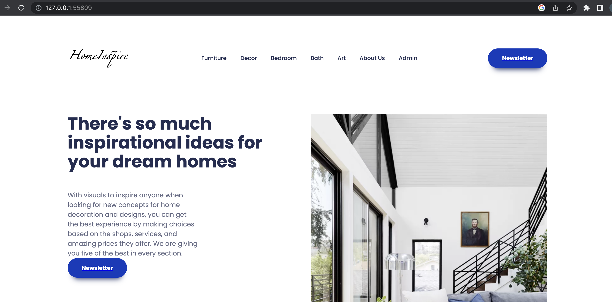
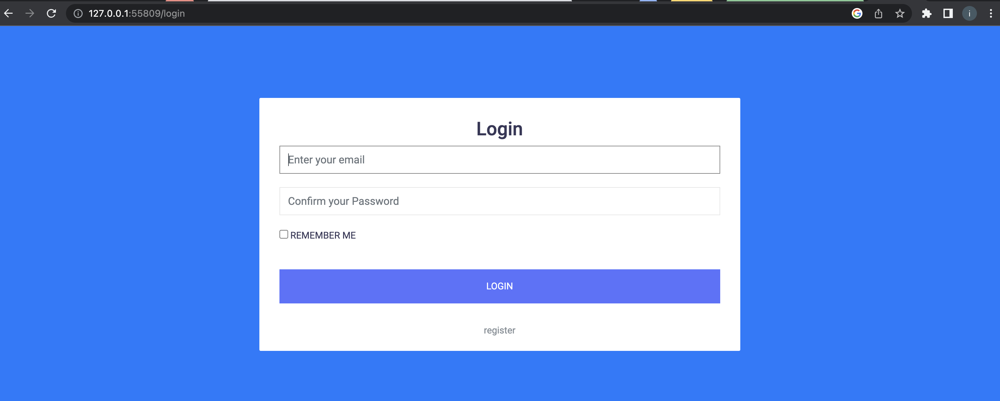
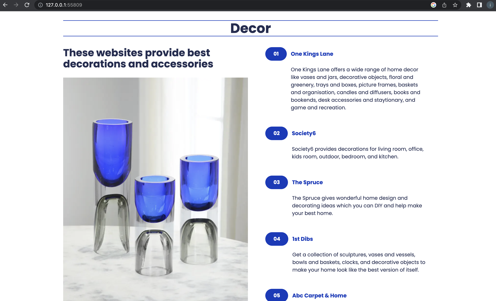
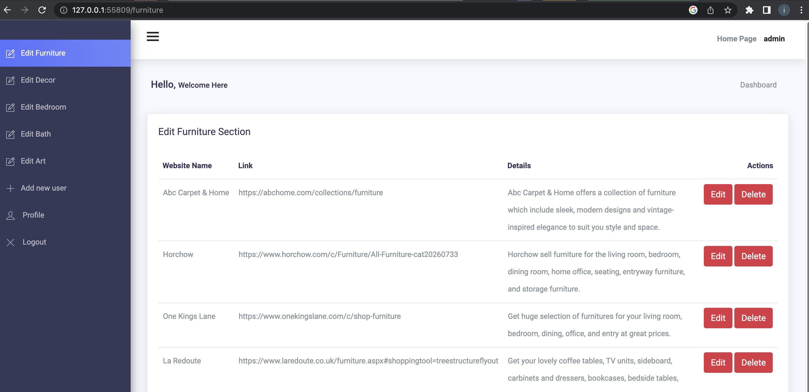
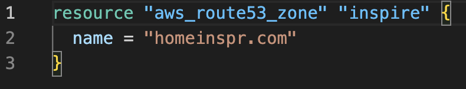
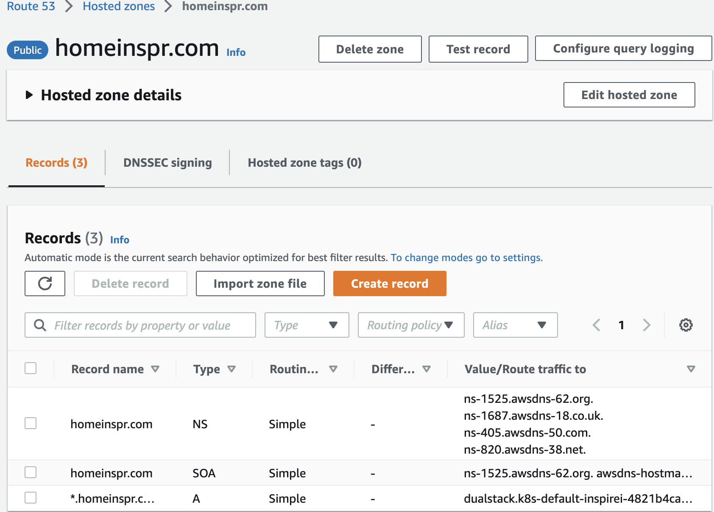
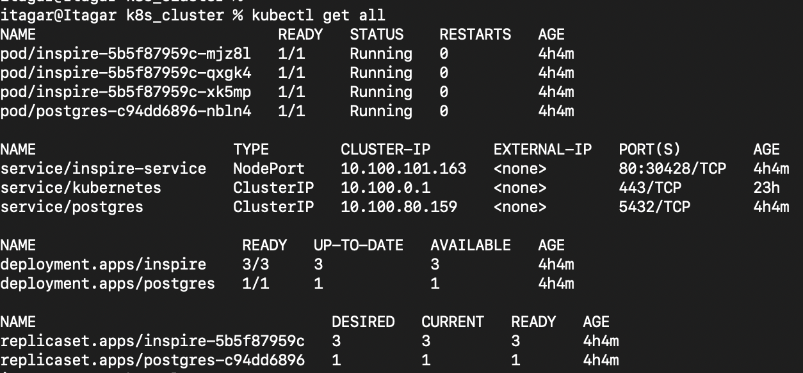
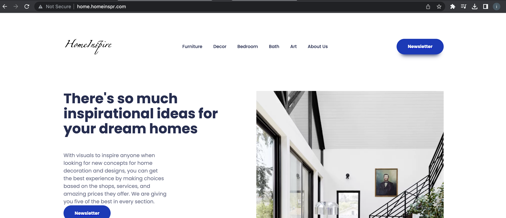
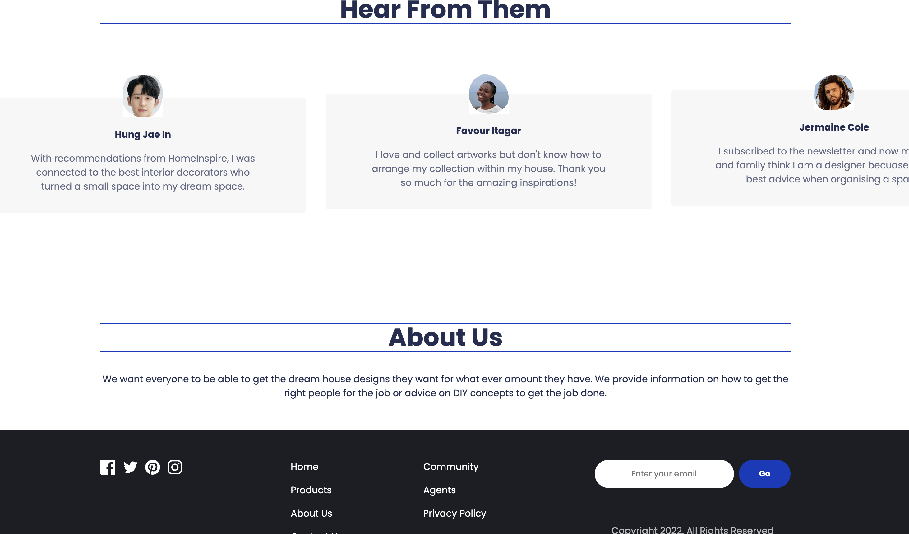

This repository has four parts: `app`, `GitHub workflow` `IAC`, and `k8s_cluster`.


`APP:`

This is a flask web application. A dockerfile exists in this repository to dockerise the flask application.

The application is divided into two microservices: Flask microservice and Postgres microservice. Each can be seen in `k8s_cluster`.
To run the app locally with the configurations for postgres on localhost (and without the S3 bucket configurations):
```
python3 app.py
```






`GITHUB WORKFLOW:`

This automatically pushes any changes made to DockerHub. Although the Docker file is only for `app`, this is a project work; thereby all the other folders like `IAC` and `k8s_cluster` are inlcuded in this repository.


`IAC:`

This part contains Terraform configuration files to provision `route 53`, `S3 bucket`, and a `dynamoDB` on AWS cloud.




To run the Terraform file:
```
Terraform init
Terraform plan
Terraform apply
```




`K8S_CLUSTER:`

This contains the deployment, service, and ingress configurations for the two microservices.

It also contains YAML files for the `AWS cluster` creation. and a `Makefile` to run the commands.

To see all the Kubernetes configuration, run:
```
kubectl get all
```



To test the microservices locally, run:
```
kubectl port-forward services/inspire-service :80
```
To run the `Makefile` commands, run `make command` e.g:
```
make deploy_application
```

Here is the application running successfully:




